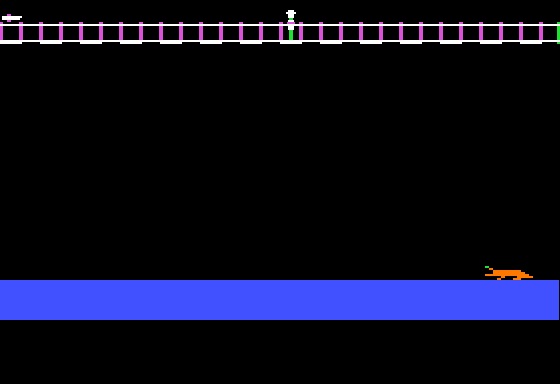
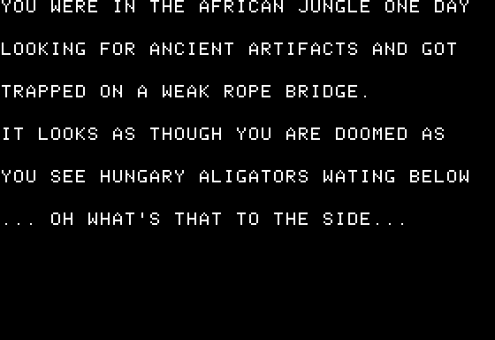

# archiologist-apple-ii
Archiologist is a simple game inspired by the rope bridge scene in Indiana Jones and the Temple of Doom.

It should be spelled Archeologist or Archæologist, but I was 13 or 14 years old.

<picture>
    <source srcset="archiologist.mp4" type="video/mp4">
    
</picture>

<figcaption>
  <em>Video capture of the game</em>
</figcaption>

<figcaption>
  <em>Animated gif of the game</em>
</figcaption>

<figcaption>
  <em>Screen capture</em>
</figcaption>

